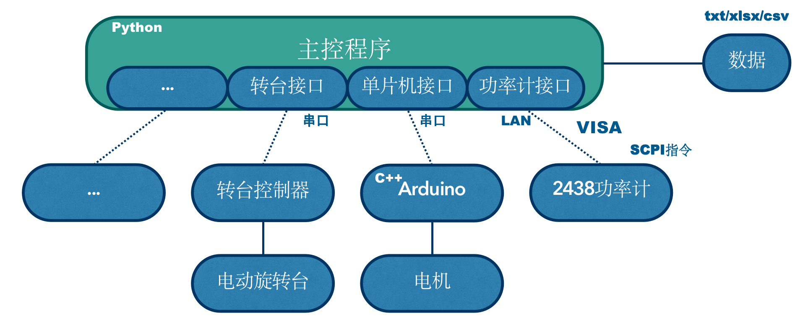
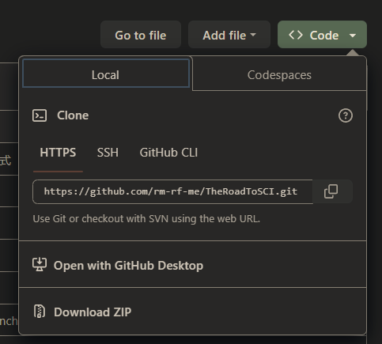
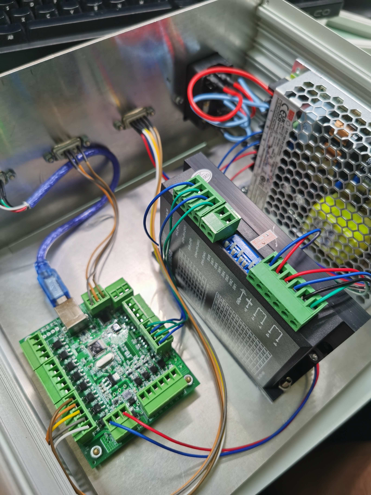
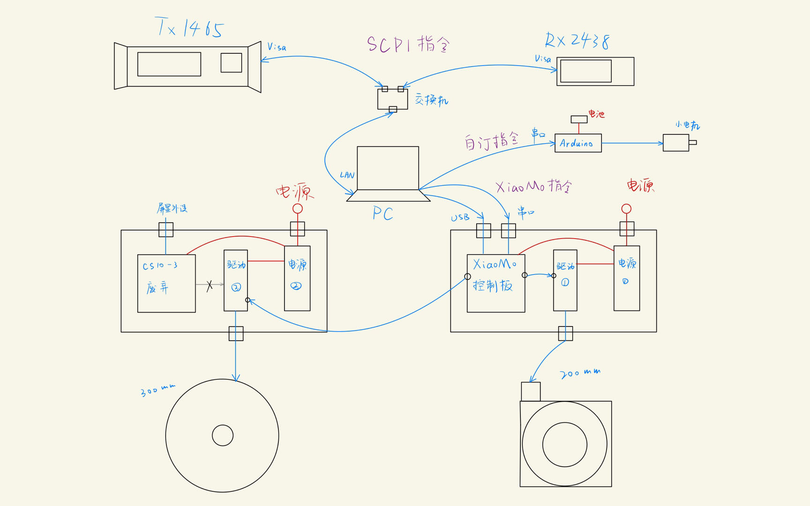
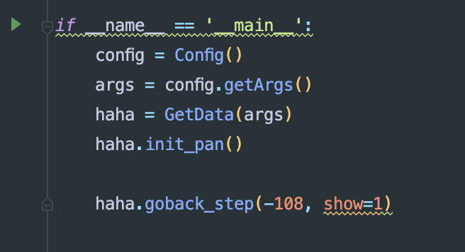
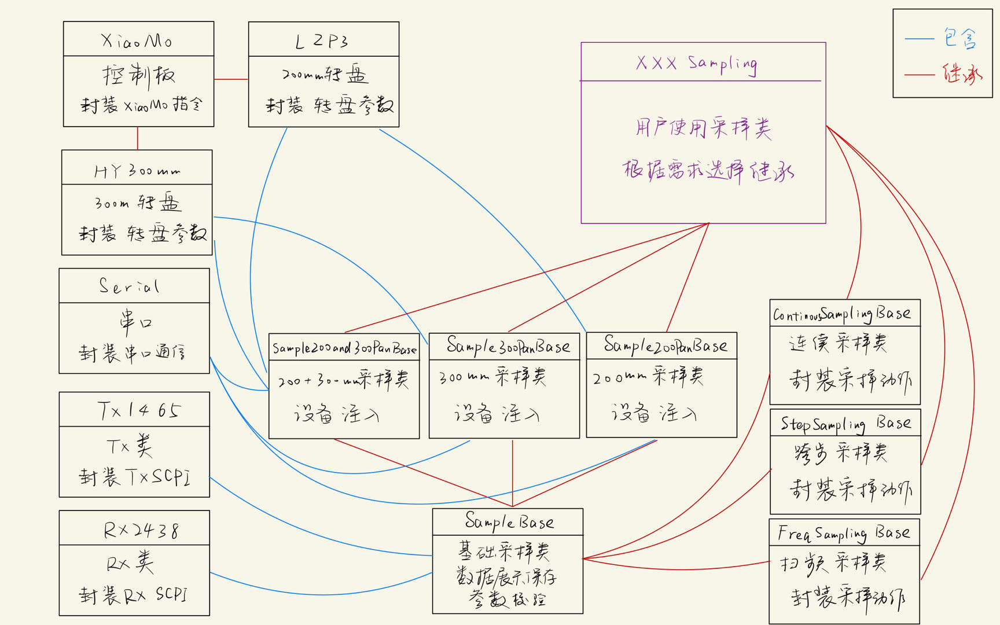

# 410自动实验系统开发手册（v5.0编写中）

--2023.5.5，ljc

> 一个人就能优雅地做实验

## 警告！

* 系统控制的机械结构具有一定危险性，所搭载的实验器材贵重，使用不当很有可能会造成人员受伤或设备损坏。运行前要着重关注旋转角度、速度、加速度等参数配置的正确性。新手和重要版本更新时请认真阅读系统文档，初次使用请在他人指导下进行实验。
* 有任何疑问不要莽，先找作者咨询！！！

[TOC]

## 0.系统简介


本系统是以Python语言为主的、联合控制多种仪器设备协同进行太赫兹实验和数据采样的自动化系统。工程遵循面向对象思想，具有良好的扩展性和灵活性。支持LAN、串口、VISA多种通信协议，能对接包括微波功率计、信号发生器、电动旋转台、步进电机、单片机等设备。转台设备精度达到0.01度、单点采样时间在100ms以内，通讯时延低，实现序列数据的自动化采样和保存。



## 1.前置知识

### 1.1.Git/Github

* git
    * git是著名的版本控制工具，能够方便进行版本更新、回滚、多分支开发等版本管理操作
    * 可至官网免费安装
* github/gitee
    * 基于git的版本共享仓库，有时需要科学上网
    * 本项目仓库路径为
        * github：https://github.com/rm-rf-me/TheRoadToSCI
        * gitee：https://gitee.com/ljcljcljcljcljc/TheRoadToSCI
* 代码拉取方法
    * 安装git

    * 打开cmd命令行，cd到对应路径，git clone https://github.com/rm-rf-me/TheRoadToSCI.git

    * 或直接web端下载zip

  

### 1.2.Python

* Python是一种方便快捷的脚本开发语言，语法简单和丰富的三方库使得该语言适合很多场景的快速开发
* 本项目使用conda进行环境管理，关于python环境配置请参考https://github.com/rm-rf-me/Python-Setup-tutorial

### 1.3.Visa

### 1.4.串口通信

### 1.5.Arduino

### 1.6.步进电机

* 步进电机是一种以脉冲控制的封装更好的电机，电机获得一定数量的脉冲信号后即会旋转一个单位的步进角，该步进角精度高，不受负载情况影响，故步进电机具备很高的控制精度。

#### 1.6.1.控制结构

* 2相步进电机的输入通常是A+ A- B+ B-四根线，通常情况下实现对步进电机的控制需要以下几个部分：

    * 电源：为驱动版和控制板供电
    * 电机驱动板：输出为四线或六线直接控制电机，输入为脉冲、方向等
    * 电机控制板：输出为驱动板脉冲、方向等控制信号，支持外接设备、串口、USB、烧录程序等控制方式
    * 控制程序：运行在PC端，和控制板进行交互

* 200mm转盘控制箱结构如图：

  

  其中从左至右依次为电机控制板、电机驱动版和电源。控制箱外部暴露四个接口，在途中从左至右依次为：USB控制线、rx232串口控制线、电机控制线、电源接口。

#### 1.6.2.参数配置

* 常见的电机参数有：
    * 细分数：即获得多少个脉冲后前进一个步进角，该参数与电机驱动板设置有关，在200mm转盘中为20，在小电机中为16
    * 步进角：即一次步进前进的读书，常见默认1.8度
    * 传动比：即电机转轴和转台或平移台之间的机械比例关系，在200mm转台中为1:180，在小电机中为1:1

## 2.环境配置

### 2.1.Python环境

* 本项目使用conda进行环境管理，关于python环境配置请参考https://github.com/rm-rf-me/Python-Setup-tutorial
* 主要包：
    * pyvisa
    * pyserial
    * pandas
    * tqdm
    * eventlet
    * matplotlib

### 2.2串口

#### 2.2.1.驱动

#### 2.2.2.串口助手

### 2.3.Visa

### 2.4.编程环境

### 2.5.电机转盘

#### 2.5.1.控制箱改装

* 接线框图，通过电路改装和外壳开洞将两套电机驱动和供电连接到一个控制板上，通过串口统一控制。
  * 

#### 2.5.2.上位机

* 小墨控制板提供配套上位机，已安装至实验室笔记本桌面，建议通过USB连接，避免占用串口

## 3.代码框架

### 3.1.文件树

* 以 Device_ 开头代表设备接口类
* 以 XXXSampling_ 开头代表数据采样形式
    * AnnularSampling：环型采样，旋转Rx或Tx
    * CentralSampling：中心采样，旋转中心物体

```c
.
├── AnnularSampling_HYGX		// 基于恒洋光学200mm电机转台的圆环旋转采样
│   ├── ContinuousConfig.py		// 连续采样配置文件
│   ├── ContinuousSampling.py		// 连续采样主函数
│   ├── StepConfig.py		// 跨步采样配置文件
│   └── StepSampling.py		// 跨步采样主函数
│   └── data	// 默认数据保存路径
│       └── __init__.py
├── CentralSampling_HY300mm		// 基于恒誉激300mm电机转台的中心旋转采样
│   ├── ContinuousConfig.py		// 连续采样配置文件
│   ├── ContinuousSampling.py		// 连续采样主函数
│   ├── StepConfig.py		// 跨步采样配置文件
│   ├── StepSampling.py		// 跨步采样主函数
│   └── data	// 默认数据保存路径
│       └── __init__.py
├── CentralSampling_LittleMotor		// 基于小电机的中心旋转采样
│   ├── GetData.py		// 主函数
│   ├── config.py		// 配置文件
│   └── data		// 默认数据保存路径
│       └── __init__.py
├── CoSampling		// 联合控制采样
│   └── Glass		// 玻璃散射透射实验的采样脚本
│       ├── config.py		// 配置文件
│       ├── data		// 默认数据保存路径
│       │   └── __init__.py		
│       └── sampling.py		// 主函数
├── Device		// 所有设备接口类
│   ├── Device_Ceyear		// 中电科思仪设备
│   │   ├── RX2438.py		// 功率计
│   │   ├── TX1465.py		// 信号发生器
│   │   └── __init__.py
│   ├── Device_HengYangGuangXue		// 恒洋光学
│   │   ├── LZP3.py		// 200mm电机转台
│   │   └── __init__.py
│   ├── Device_LittleMotor		// 小电机
│   │   ├── LittleMotor.py
│   │   ├── __init__.py
│   │   └── arduino		// 小电机对应arduino控制板程序
│   │       └── Emm42_Arduino_WHILE.ino
│   ├── Device_ShenZhenHengYu		// 恒誉激光
│   │   ├── HY300mm.py		// 300mm电机转台
│   │   └── __init__.py
│   ├── __init__.py
│   └── util		// 工具类
│       ├── Serial.py		// 串口通信类
│       ├── XiaoMoRotate.py		// 小墨控制板接口类
│       └── __init__.py
├── FreqSampling_1465		// 频率步进采样
│   ├── StepConfig.py		// 频率步进配置函数
│   ├── StepSampling.py		// 主函数
│   └── data
│       └── __init__.py
├── README.md
├── Tool
├── doc		// 文档目录
│   ├── Development.md		// 开发者文档
│   ├── QuickStart.md		// 快速上手文档
│   ├── img		// 文档配图
│   │   └── *.png
│   ├── 开发手册.pdf
│   └── 快速上手.pdf
├── script		// 批量采样脚本路径
│   ├── __init__.py
│   ├── get_lstm_data.py
│   └── get_pvc_data.py
└── utils		// 工具类
    ├── __init__.py
    ├── cmdIO.py		// 命令行交互
    ├── config		
    │   ├── __init__.py
    │   └── base_config.py		// 通用配置文件
    └── sampling		// 采样配置及动作类
        ├── __init__.py
        ├── base_sampling.py		// 基础采样类
        ├── freq_sampling.py		// 频率步进采样
        └── xiaomo_sampling.py		// 小墨控制板采样
```

* 如果没有开发意愿，则可以忽略所有Device开头的路径。只需关注每个XXXSampling开头的采样路径

### 3.2.XXXSampling

* 规定该路径下会包含以下内容：

    * GetData.py：主函数
    * config.py：配置文件
    * data/：数据保存位置

  其余内容可以不关注

### 3.3.GetData.py

* 文件最下方都包含类似结构，为当前采样的主运行脚本，点击绿色三角即可运行，注意一定要先确认运行配置无误！！！

  

### 3.4.参数配置

* 本项目需配置的参数较多，主要包含以下几类：

    * 设备参数：用户不用考虑
    * 采样基础参数：用户不用考虑
    * 采样参数：需要配置

* 其中的采样参数即为旋转角、步长、步延迟等根据采样需求调整的参数，主要有三种配置途径：

    1. 关键参数在命令行中交互配置
    2. 函数调用传参
    3. config.py文件配置

  注意三种参数的优先级递减，也就是说函数传参会覆盖config.py配置，而命令行交互会覆盖函数传参

## 4.面向对象设计

* 
