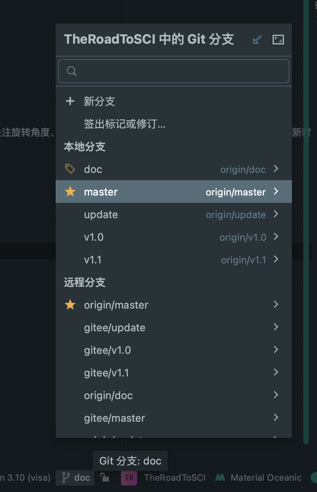
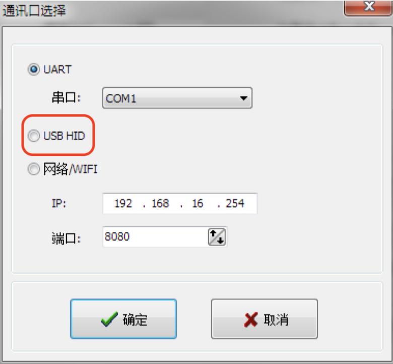
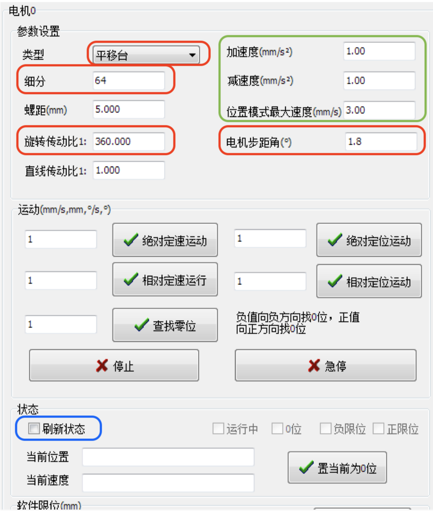
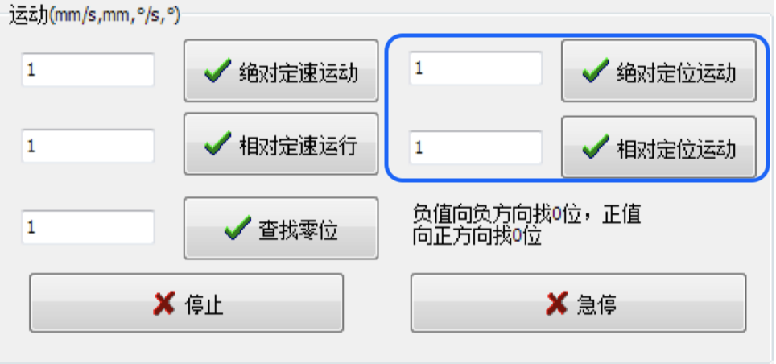
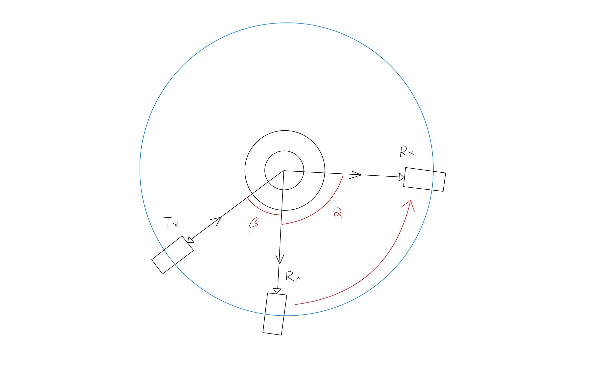
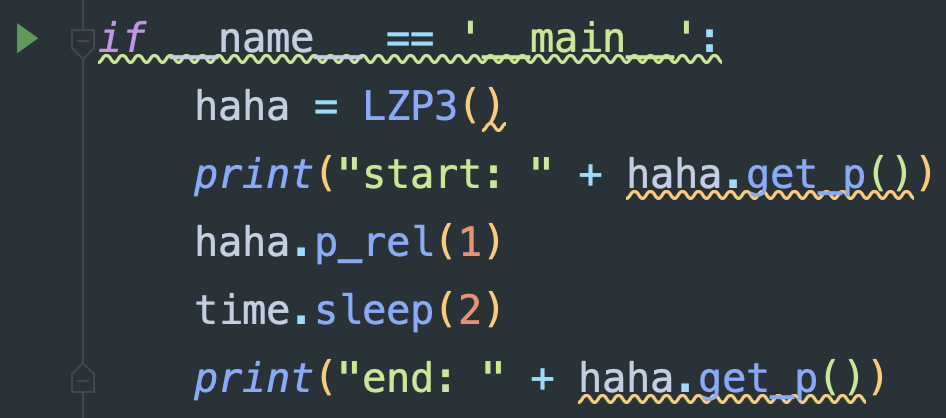
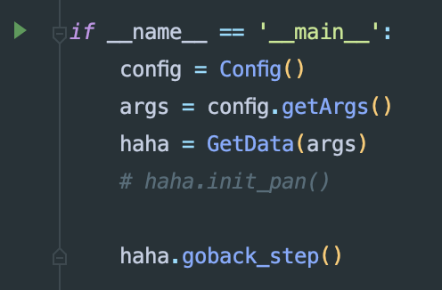

# 410自动实验系统快速上手（v5.0编写中）

--2023.5.5，by ljc

> 一个人就能优雅地做实验

## 警告！

* 系统控制的机械结构具有一定危险性，所搭载的实验器材贵重，使用不当很有可能会造成人员受伤或设备损坏。运行前要着重关注旋转角度、速度、加速度等参数配置的正确性。新手和重要版本更新时请认真阅读系统文档，初次使用请在他人指导下进行实验。
* 有任何疑问不要莽，先找作者咨询！！！

[TOC]

本文讨论系统在实验室ThinkPad笔记本电脑上的使用方法。

## 1.接线方式

实验室ThinkPad笔记本电脑需连接：

* 电源线
* 功率计蓝色网线
* 电机控制箱的蓝色黑色两根usb接口线

## 2.软件位置及说明

### 2.1.项目代码及版本切换

* 由于不同版本间代码差距较大，在运行前请详细核对代码版本和对应使用方法。

* 不出意外的情况，电机桌面的Pycharm打开的就是本项目工程代码。如果不是，请于右下角最近项目出选择，或于左上角项目-打开菜单中打开D:/Project/TheRoadToSCI路径。

* 本项目使用git/github进行版本管理和代码分发，需在使用前确认当前版本。点击界面右下角的分支图标：

  

  可以浏览到本地和远程的多个版本分支：

    * master分支：版本主分支，是当前通过实测的最新版本，可参考最新版文档开头的版本记录。

    * vX.X分支：X为数字，代表该版本的最后一个稳定分支，用于快速回退到历史版本

      其余版本都可以忽略

* 选择好对应版本后单击，选择**签出**，如提示签出问题则选择**智能签出**

* 待下方进度条完成后可发现代码回退到了对应版本。

### 2.2.转盘上位机

#### 2.2.1.连接

* 打开软件，电机左上角连接设备，会弹窗提示连接方式：USB和串口均可以使用（蓝色线为USB，黑色线为Rx232串口线），但由于系统Python代码使用串口控制，所以上位机**选择USB连接**。

  

#### 2.2.2.模式选择

* 弹出主控制窗口，上方标签栏选择开环控制（物理单位）

  

#### 2.2.3.参数设置

* 然后设置四个红框中的电机基本参数：

    * 类型：旋转台
    * 细分：20
    * 传动比：180
    * 步进角：1.8

  

* 设置绿色框中的电机运动参数：不要太大，10以内

    * 加速度
    * 减速度
    * 最大速度

* 然后勾选蓝色框中的刷新状态，可以查看和控制当前坐标系下的转盘位置

#### 2.2.4.基本运动模式

* 上位机提供几种运动模式：

  

  只需要关注蓝色框中的绝对定位和相对定位即可：

    * 绝对定位：根据输入的角度值运动到相对于转盘设置的坐标系零点的位置
    * 相对定位：根据输入的角度值运动到相对于当前转盘的位置

  正数为顺时针，负数为逆时针，单位是度

* 停止是立刻开始按照减速度逐渐停止，急停是立刻停止。

#### 2.2.5.说明

* 转盘上位机仅用于采样动作各项参数的快速定位，以及紧急情况下停转的工具。上位机中的参数和Python系统中的参数没有任何关系，上位机参数配置和Python参数配置互不干涉。

## 3.采样步骤

### 3.1.中心旋转跨步序列采样

* 待编写

### 3.2.圆环旋转跨步序列采样-200mm转盘

#### 0.采样动作

* 圆环旋转指代Rx围绕圆环做圆周运动，跨步意为Rx会以固定角度步长逐次采样，测量结束后经过先加速再减速自动推进到下一位置继续采样，完成序列上所有点的采样后，会自动进行曲线绘制和数据保存。

* 实验台如图：

  

  默认Tx不动，Rx沿红箭头做圆周运动，此处涉及几个参数：

    * 相对Tx的初始位置角：$\beta$
    * 运动角：$\alpha$
    * 运动方向：顺时针 or 逆时针，在系统和上位机中**正角度为顺时针，负角度为逆时针**
    * 步长：以度为单位
    * 运动参数：
        * 加速加速度：acc
        * 减速加速度：dec
        * 最大速度：v
    * 单步睡眠时间：Rx运动到新位置后设备平复震动和功率计完成测量的时间，以秒为单位。

#### 1.设备搭建

* 直尺固定，RxTx固定对齐
* 功率计使用网线连接
* 控制箱开机，连接黑色串口线和蓝色usb线
* 信号发生器开机，放大器开机，配置信号参数
* 功率计开机，配置参数选择对应测量频率

#### 2.设备测试

* 运行Device_Ceyear/RX2438.py文件，打印功率即为连接成功

  

* 运行Device_HengYangGuangXue/LZP3.py文件，电机旋转一度即为连接成功    

#### 3.明确运动参数

* 使用转盘上位机软件控制Rx运动到始末位置，并通过转盘刻度读数结合上位机软件读数确定转盘初始位置$\beta$、旋转角度$\alpha$和运动方向
* 出于安全考虑，请将Rx置于靠近Tx的位置作为初始位置。
* 小心碰撞

#### 4.采样参数配置

* 设置config文件，参数如下：

  ```python
  # 当前使用的频率，字符串形式，用于记录
  self.parser.add_argument('--freq', type=str, default="None")
  
  # 当前使用的功率，浮点数形式，用于记录，单位为dbm
  self.parser.add_argument('--power', type=float, default=0)
  
  # 加速加速度，米/秒^2
  self.parser.add_argument('--acc', type=float, default=8)
  
  # 减速加速度，米/秒^2
  self.parser.add_argument('--dec', type=float, default=6)
  
  # 最大速度阈值，米/秒，超过15会丢步
  self.parser.add_argument('--v', type=float, default=8)
  
  # 步内等待时间，从转盘完全停止开始计时，秒
  self.parser.add_argument('--delay', type=float, default=0.2)
  
  # 步长，可以是小数
  self.parser.add_argument('--stride', type=float, default=2)
  
  # 从当前位置开始的最远转动角度，一定要小心不要打到东西；正数为顺时针，负数为逆时针
  self.parser.add_argument('--max_angle', type=float, default=-6)
  
  # 单条数据采样结束后是否展示曲线
  self.parser.add_argument('--show_pic', type=bool, default=True)
  
  # 单条数据采样结束后是否保存曲线
  self.parser.add_argument('--save_pic', type=bool, default=False)
  
  # 每步采样后是否阻塞等待
  self.parser.add_argument('--step_block', type=bool, default=False)
  
  # 数据保存格式，支持txt、xlsx、csv
  self.parser.add_argument('--data_type', type=str, default='txt')
  ```

#### 5.Rx置于初始位置

* 通过上位机软件将Rx置于初始位置
* 出于安全考虑，该位置应当靠近Tx

#### 6. 开始测量

* 点击左侧绿色三角运行GetData.py文件，开始和命令行交互

  

* 程序会首先进行设备连接确认和运动参数配置，跟随命令行引导即可

* 每步采样过程涉及两次描述输入：

    1. 请描述本次测量：可以输入中英文任何文本，该文本将与采样数据一同写入保存文件中
    2. 请为数据命名：命名所保存的数据文件，尽量不用使用中文、不可见字符、冒号、点等符号

  在当前版本中，数据会被保存在XXSampling_XXX/data/路径下，命名格式为：时间戳-频率-功率-自定义名称.xxx，文件格式可为txt、csv、xlsx。

* 为了保证安全性和初始位置一定，程序运行一次会执行往返两次采样，两次采样结束后Rx将回到初始位置，并且退出程序。

#### 关于急停

在紧急情况下，如果需要急停请考虑：

* 使用上位机软件中的停止或急停选项
* 终止系统进程
* 关闭控制箱电源

急停后需通过上位机手动将Rx调整会初始位置，再使用Python程序进行测量。

### 3.3.频率跨步采样

* 待编写